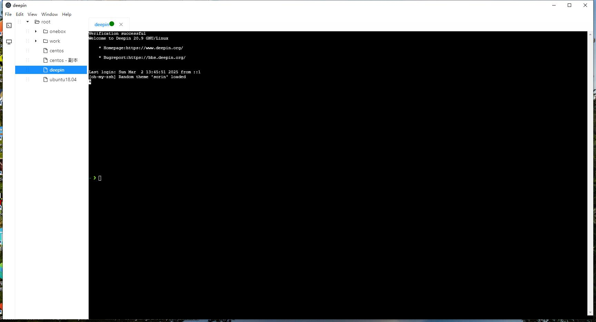
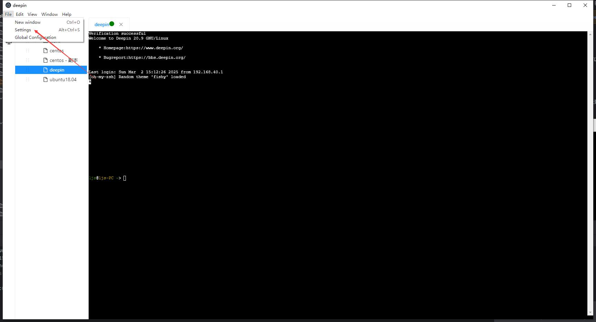
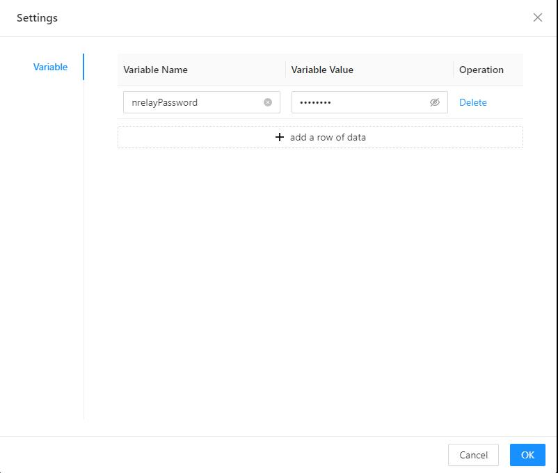
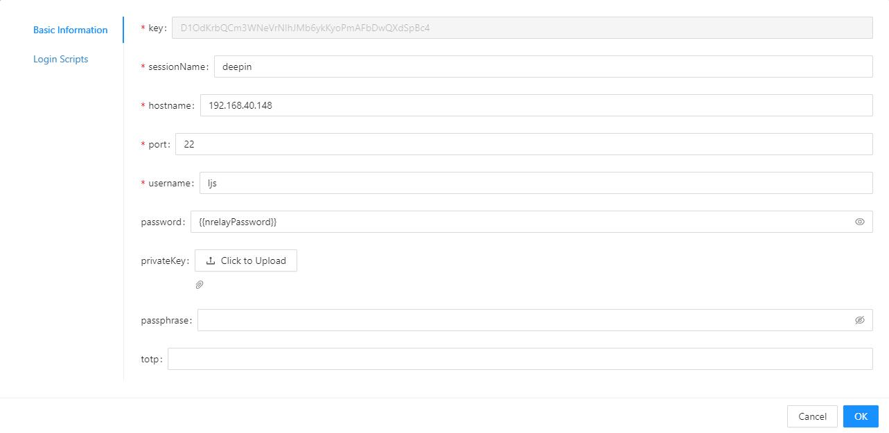
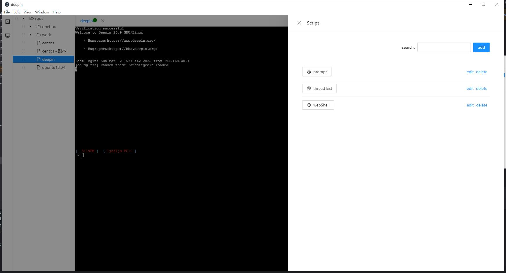
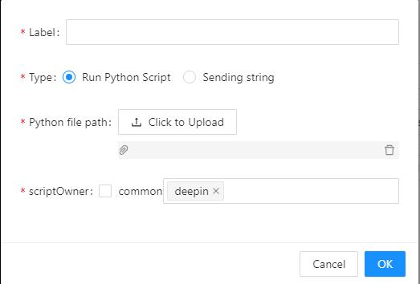
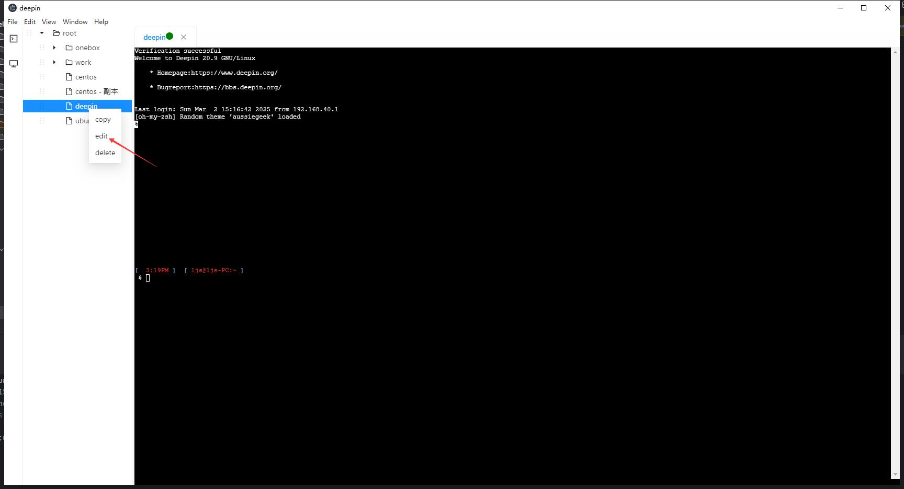
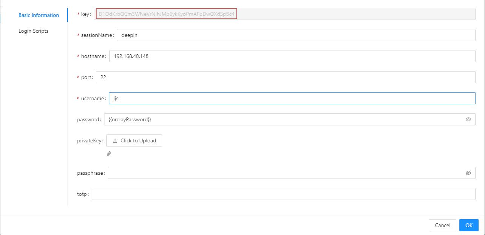

# elecshell

[中文](README_cn.md)

# Introduction

A web application used as an ssh client to connect to an ssh server

In previous work, I have come into contact with many ssh client tools such as finalShell, xshell, MobaxTerm, etc. Among them, the script function of xshell has saved me a lot of time in some cases, but the script of xshell can do limited things, and there are the following problems:

1. Inconvenient to use, for example, if you want to use a non-system module requests to send a network request, you must first install the module. The python of xshell is built-in, not the python installed by the user, so the operation cannot be implemented and Baidu has no results, and no good solution has been found

2. You can create a new session, but the created session is not controllable by the user

3. You can send commands but cannot receive the return results after the command is executed

elecshell supports the above functions


# Preview



# Environment

You need to install python3 and have an available python or python3 command in the command line. It is recommended that the python version is 3.9 or above. Then you need to install the python module
```text
paramiko==3.0.0
tornado==6.2.0
appdirs==1.4.4
requests==2.32.3
watchdog==4.0.1
psutil==5.9.5
```

You also need to install node and yarn, then execute the yarn command in the project root directory and wait for it to be executed.

# Development

1. Run the main.py script in the server directory of the project root directory
2. Execute yarn run start in the project root directory
3. Execute yarn run app in the project root directory

# Deployment
1. Execute <b>yarn run build</b> in the project root directory
2. Execute <b>yarn run app:build</b> in the project root directory

Then a build folder will be generated in the project root directory, which contains the software installation program

# Features

## Upload and download
After opening a session window, you can switch to the file transfer tab


You can query the directory and file name under the specified path of the server, and upload and download by dragging. Linux can only upload and download under the user directory and subdirectory.

First, the file will be transferred through sftp. If sftp is not available, a server will be started remotely to transfer the file. The server will automatically exit when the current session is closed.

## Login script
You can send some configured commands immediately when the session is created

Sometimes some servers have restrictions and can only connect through an intermediate machine as a relay. After logging into the intermediate machine, enter the target IP and other information to connect. At this time, you can
set up a login script to automatically enter relevant information after logging into the intermediate machine and jump directly to the target machine

## Variables
The company may force you to change the password of the OA account every once in a while, and all sessions are logged in with this account. This feature is to prevent the need to change the configuration of a large number of sessions when changing the password. You can configure it in File-Settings





As shown in the figure, the variable name is set to nrelayPassword, and the corresponding variable value is 2wsxZAQ!. When using it, you can wrap the variable in two curly brackets in the basic information of the session. As shown in the figure below, the actual password used for connection is 2wsxZAQ!



Support hostname, username and password

## script
ctrl + q will pop up the script window. If there is no active session, no available scripts will be displayed.



Click the Add button to display the following interface



The label is the button name displayed on the interface

The script type is divided into the following two types. The function of sending a string is to record a command. When you click the button, the command you wrote will be sent to the terminal. To run a python script, you need to write a python script yourself, and the script will be executed locally when you click the button

If the script is public, all sessions can use this button, including newly configured sessions in the future; if it is not checked, only the session selected on the right can use it (the button cannot be seen when other sessions are active)

The entry point of the python script is the Main function, which accepts a formal parameter, which can be considered as the context object representing the current session. The functions in this object do not support
calling through multiple threads, but can be called in a multi-coroutine manner through the asyncio module

## API

ctx.prompt: pop-up window receives user input

The first parameter is a string, showing the title of the pop-up window

The second parameter is a callback function

The subsequent parameters are passed by themselves and will be passed to the callback function in the same order

Callback function: process the input result

The first parameter represents the current session context

The second parameter is the user's input

The rest are parameters passed by themselves when calling ctx.prompt

```python
def prompt_callback(ctx, result, my_arg):
    print("The parameters passed in by yourself are: {}".format(my_arg))
    if not result:
        return
    print(f'Your input is {result}')
    ctx.send(result + '\r')

def Main(ctx):
    ctx.prompt("Please enter the command to be executed:", prompt_callback, 4)
```

ctx.send: send command
```python
def Main(ctx):
    ctx.send("pwd")
```

ctx.recv: Send the executed command and get the returned result

First parameter: the executed command

Second parameter: callback function

Third function: the waiting time after sending the command, in seconds. 0 means that the result of the command is returned immediately.
Some command results are returned in multiple times. If 0 is filled in here, the received execution result may be incomplete

The subsequent parameters are passed by themselves and will be passed to the callback function in the same order

Callback function: process the result of command execution

First parameter: current session context

Second parameter: result of command execution

The rest are parameters passed by themselves when calling ctx.recv

```python
def handleRecv(ctx, ret):
    if "dev" in ret:
        ctx.send('echo "current session has result with dev"')

def Main(ctx):
    ctx.recv("ls /", handleRecv, 0)
```

ctx.create_new_session: Open new sessions

The first parameter: is a list of session configuration ids. The elements in the list can be the id of the session configuration (string) or an object. The object's conf_id indicates the id of the session configuration, and session_name indicates the tag name of the created session

The second parameter: callback function

The subsequent parameters are passed by themselves and will be passed to the callback function in the same order

Callback function: can continue to perform corresponding operations on the newly created session

The first parameter: the current session context

The second parameter: is a list representing the context of all created sessions

The rest are parameters passed by themselves when calling ctx.create_new_session


```python
import asyncio


def handleRecv(ctx, ret):
    if "dev" in ret:
        ctx.send('echo "current session has result with dev"')


async def handle_one(created_ctx, cmd):
    created_ctx.recv(cmd, handleRecv, 0)


def callback(ctx, created_ctxs, a, b):
    print("Custom parameter addition result: {}".format(a + b))
    cmds = ['pwd', 'ls /']
    for i in range(len(created_ctxs)):
        asyncio.create_task(handle_one(created_ctxs[i], cmds[i]))


def Main(ctx):
    ctx.create_new_session([ctx.get_xsh_conf_id(), {"conf_id": ctx.get_xsh_conf_id(), "session_name": "xxx"}], callback,
                           3, 4)

```

The ctx.get_xsh_conf_id function can get the id of the current session configuration

This script is equivalent to opening the current session twice, and executing the "pwd" and "ls /" commands in the two newly created sessions respectively. If the return result of the command executed by a session contains the string dev, then the print command will be executed again in that session

If you want to open another session, you can pass the configuration id of this session in the first function of ctx.create_new_session. The id can be seen by editing





ctx.recv_util: Send the command to be executed and get the return result. Compared with the recv function, this function will wait until a certain byte string appears before returning.

First parameter: the command to be executed

Second parameter: a byte string. This function will continue to receive the execution result of the command until the byte string appears before calling the callback function.
<font color="red">If the byte string does not appear in the result, the process will be stuck</font>

Third function: callback function

The subsequent parameters are passed by themselves and will be passed to the callback function in the same order

Callback function: Process the result of command execution

First parameter: current session context

Second parameter: result of command execution

The rest are parameters passed by themselves when calling ctx.recv_util

```python
def handleRecv(ctx, ret):
    ctx.send('echo "current session has result with dev"')

def Main(ctx):
    ctx.recv_util("ls /", b'dev', handleRecv)
```

ctx.recv_regexp: Send the command to be executed and get the return result. Compared with the recv function, this function will wait until the received result matches a regular expression.

First parameter: the command to be executed

Second parameter: a regular expression. <font color="red">If the result does not match the regular expression, the process will be stuck</font>

Third function: callback function

The subsequent parameters are passed by themselves and will be passed to the callback function in the same order

Callback function: process the result of command execution

First parameter: current session context

Second parameter: result of command execution

The rest are parameters passed by themselves when calling ctx.recv_regexp

```python
import re

def handleRecv(ctx, ret):
    ctx.send('echo "current session has result with dev"')

def Main(ctx):
    exp = re.compile(b'h.me', flags=re.MULTILINE | re.DOTALL)
    ctx.recv_regexp("ls /", exp, handleRecv)
```

# Hot key
## windows/linux
ctrl + insert: copy

shift + insert: paste

## mac
command + c: copy

command + v: paste
