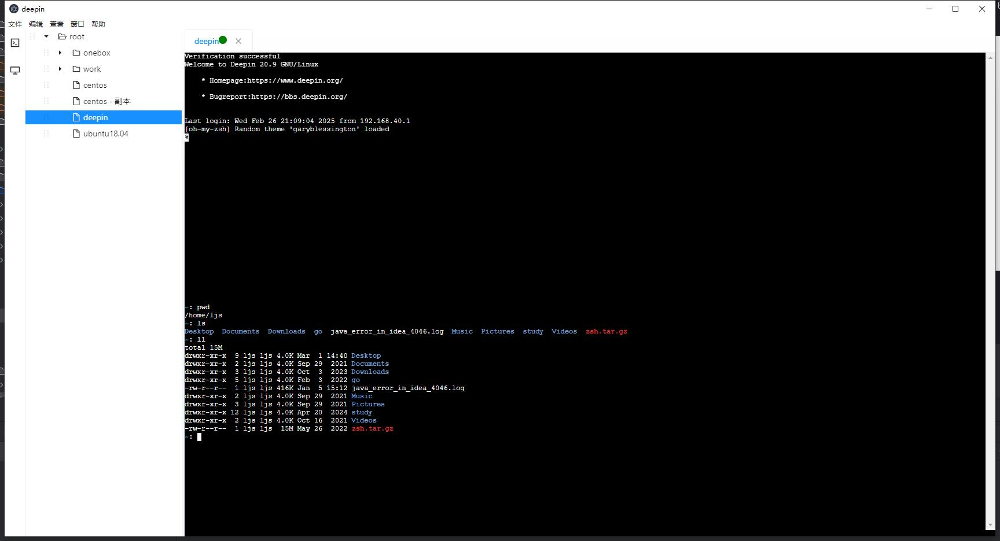
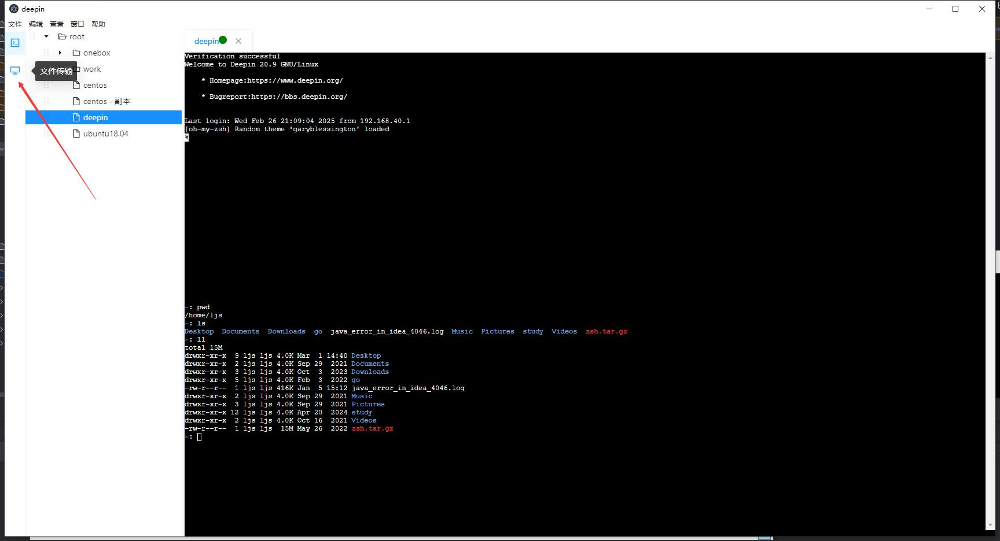
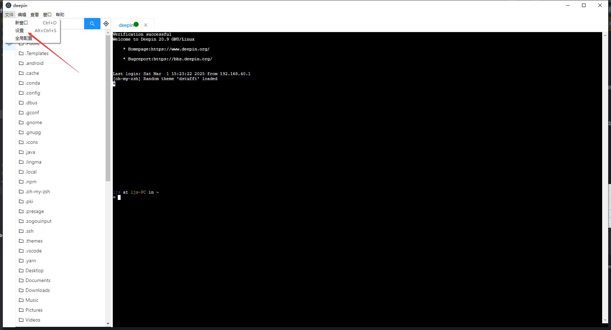
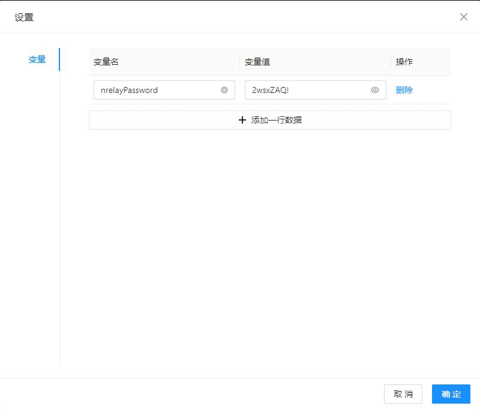
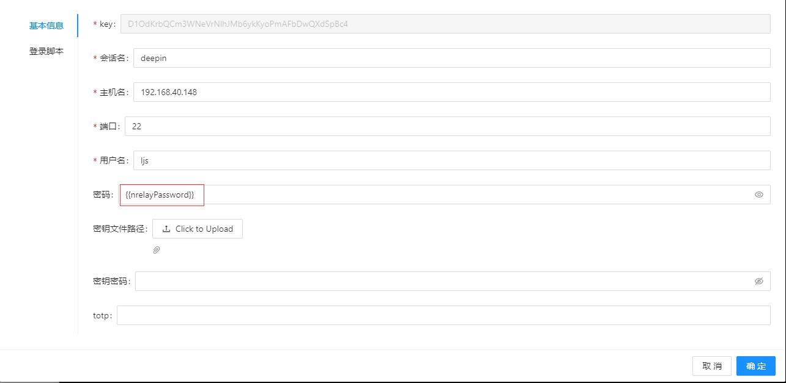
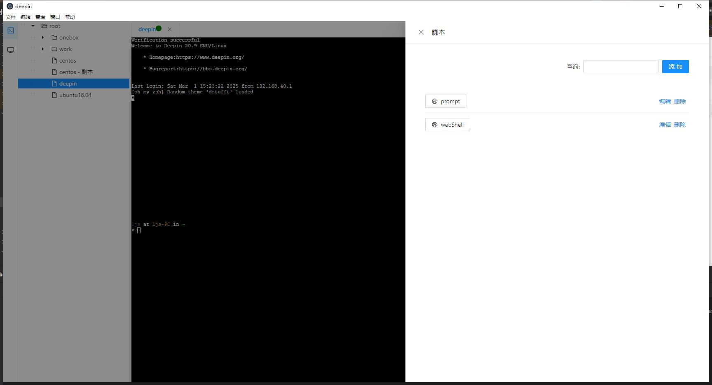
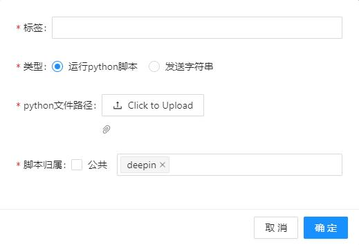
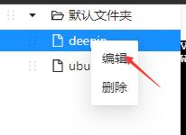
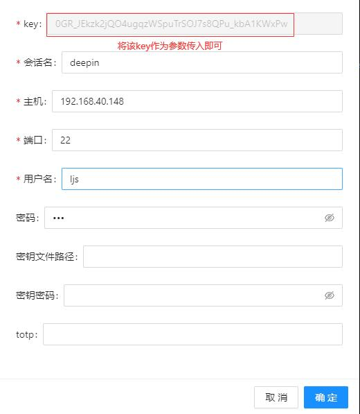

# elecshell


# 介绍

用作 ssh 客户端以连接到 ssh 服务器的一个 Web 应用程序

在以往的工作中接触到了很多的ssh客户端工具如finalShell,xshell,MobaxTerm等,其中xshell的脚本功能在某些情况下节省了我不少的时间,但是xshell的脚本可以做的事情也比较有限,存在以下问题:
1. 使用不便,比如想要使用一个非系统模块requests去发送一个网络请求,首先就要先安装该模块,xshell的python是自带的,并不是用户自己安装的python,故无法实现该操作且百度无果,没有找到好的解决方案
2. 可以创建新的会话,但是创建出来的会话用户不可控
3. 可以发送命令但是无法接收命令执行后的返回结果

elecshell支持上述功能

# 预览



# 环境
需要安装python3且命令行中存在可用的python或者python3命令,建议python的版本在3.7以上
之后需要安装一下python模块
```text
paramiko==3.0.0
tornado==6.2.0
appdirs==1.4.4
requests==2.32.3
watchdog==4.0.1
```

还需要安装node和yarn,之后在项目根目录下执行yarn命令等待执行完毕

# 开发
1. 在项目根目录/server 下运行 main.py 脚本
2. 在项目根目录下执行 yarn run start
3. 在项目根目录下执行 yarn run app

# 打包部署
1. 在项目根目录下执行 yarn run build
2. 在项目根目录下执行 yarn run app:build

之后会在项目根目录下生成build文件夹,里面有软件的安装程序

# 特性
## 文件上传与下载
打开一个会话窗口后可以切换到文件传输页签



可以查询服务器指定路径下的目录与文件名,并通过拖拽进行上传与下载

首先会通过sftp的方式进行文件传输,若sftp不可用,那么会先在远程启动一个服务器进行文件传输

## 登录脚本
可以在会话创建时立即发送一些配置好的命令

有时候一些服务器做了限制,只能通过堡垒机作为中转进行连接,登录堡垒机之后输入要连接的目标ip等信息进行连接,这时可以
设置登录脚本,在登录堡垒机之后自动输入相关信息直接跳转到目标机器


## 可设置变量
公司可能会强制要求每个一段时间换一次使用的oa账号的密码,而所有的会话都是用这一个账号去登录的,该特性时为了防止更
换密码时需要改动大量会话的配置,可在文件-设置中进行配置





如图,设置了变量名为nrelayPassword,对应的变量值为2wsxZAQ!,使用时可以在会话基本信息中以两个大括号包裹变量的方式
使用,如下图,实际用来连接的密码是2wsxZAQ!


支持 主机名,用户名和密码

## 脚本
存在活跃的会话时鼠标移动到窗口的最右侧可弹出脚本窗口


点击添加按钮显示如下界面



标签是显示在界面上的按钮名字

脚本类型分为以下两种,发送字符串的功能是记录一个命令,之后点击按钮时会向终端发送自己编写的命令,运行python脚本则需要你
自行编写一个python脚本,点击按钮时会在本地执行该脚本

脚本归属如果勾选公共,所有的会话都可以使用该按钮,包括以后新配置的会话;若不勾选则仅右侧选中的会话可以使用(其他的会话处于活跃状态时无法看到该按钮)

python脚本的入口为Main函数,接受一个形参,可以认为是代表了当前会话的一个对象

### API
ctx.prompt: 弹窗接收用户输入
```python
def prompt_callback(ctx, result, my_arg):
    print("自行传入的参数为: {}".format(my_arg))
    if not result:
        return
    print(f'用户的输入为{result}')
    ctx.send(result + '\r')


def Main(ctx):
    ctx.prompt("请输入要执行的命令:", prompt_callback, 4)
```

```python
def callback(ctx, created_ctxs, a, b):
    print("自定义参数相加结果: {}".format(a + b))
    cmds = ['pwd\r', 'ls /\r', 'ls\r']
    for i in range(len(created_ctxs)):
        ret = created_ctxs[i].on_recv(cmds[i % len(cmds)])
        if "dev" in ret:
            created_ctxs[i].send('pwd\r')


def Main(ctx):
    ctx.create_new_session([ctx.get_xsh_conf_id()]*2, callback, 3, 4)
```
该脚本相当于复制了当前会话2次,并在新的会话中分别执行了"pwd"与"ls /"命令,其中如果某个会话执行的命令的返回结果中有dev这个字符串,那么那个会话再执行一次"pwd" 命令

如果要打开一个其他的会话,可以在ctx.create_new_session的第一个函数中传入这个会话的配置文件的id,该id可以通过编辑的方式看到






## Hot key
ctrl + insert: 复制

shift + insert: 粘贴
